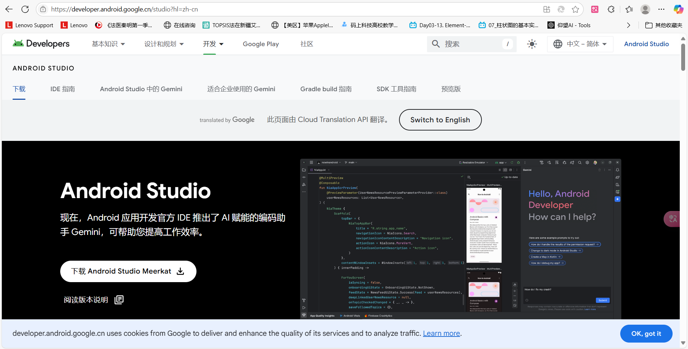
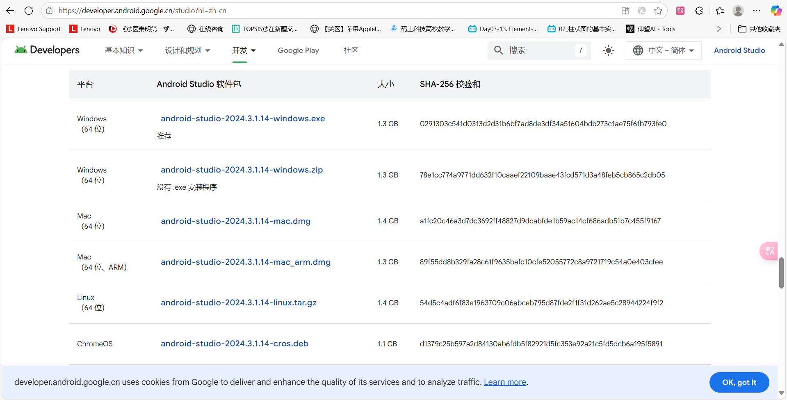

# 安装流程

## 一、Android Studio 4.1+ 安装（Koala版本）

### 1. 系统要求
- Windows 10 (64位) / macOS 10.14+ / Linux (Ubuntu 18.04+)
- 8GB RAM（推荐16GB）
- 4GB 可用磁盘空间

### 2. 安装步骤 

​	(由于去年上安卓课下载过了，所以缺少安装过程截图)

1. **下载安装包**  
   访问[官方下载页面](https://developer.android.google.cn/studio?hl=zh-cn) 
   

   选择一个下载

   

​	2. **运行安装程序**  

```bash
# Windows
android-studio-2024.3.1.14-windows.exe

# macOS
hdiutil mount android-studio-2023.3.1.20-mac.dmg

# Linux
unzip android-studio-*.zip -d /opt/
```

​	3. **安装成功运行，点击【finish】，直接运行**

​	4. **新建Project，会弹出安装SDK**

​	5.  **运行测试，下载gradle**

​	6. **创建一个模拟器**


​	7.运行成功


## 二、Jupyter Notebook

(大二上过的机器学习安装过了，所以缺少过程截图)

#### 1. 安装pip


#### 2.安装python


#### 3. 安装Jupyter Notebook

```
pip install notebook
```


## 三、Visual Studio Code配置

(上javaee安装过了，所以缺少过程截图)


